# ARCHITECTURE.md — GCIS

## Process topology (ARC-03)
```
supervisor
 ├─ ingest  : Transport(WS+poll) → Normaliser → Validator → Sequencer → Aggregator → Persistence+EventOutbox → RawRecorder
 ├─ core    : Analysis(ICT/SMC) → Regime → Strategy → Gates/Fusion → Lifecycle → Risk → Execution(Paper) → Outcomes — SINGLE WRITER of signals, orders, positions, risk
 ├─ slow    : News, secondary providers (CoinPaprika/CoinLore), metadata refresh — writes only own tables
 └─ ui      : Streamlit — reads read-models, writes commands only (INV-06)
Offline CLIs: download_history, backtest, walk_forward, training, census, replay_verify — reuse library, never write live-state.
```

## Data flow (Mermaid)

```mermaid
graph LR
  A[Binance REST/WS<br/>data-api.binance.vision<br/>wss://data-stream.binance.vision] --> B(ProviderGateway<br/>token bucket 50% budget)
  B --> C[Transport StateMachine<br/>WEBSOCKET→DEGRADED→RECOVERING]
  C --> D[Normaliser<br/>ms/µs→µs UTC]
  D --> E[Validator<br/>OHLC, volume]
  E --> F[Candle Store PG+Parquet<br/>LatestQuotes]
  F --> G[MarketView as_of]
  G --> H{ICT Detectors}
  H --> I[Regime v1]
  I --> J[Strategy ICT-A]
  J --> K[Gates MV/PX]
  K --> L[Fusion score 0-100]
  L --> M[Signal Lifecycle]
  M --> N[Risk Engine<br/>HARD caps]
  N --> O[Paper Execution<br/>conservative fills]
  O --> P[Outcomes<br/>counterfactual]
  P --> Q[Backtest/Census]
  Q --> R[Probability<br/>empirical-Bayes]
  M --> S[Commands Table]
  S --> T[Streamlit UI<br/>read-models only]
```


## Storage split (ARC-07)
- **PostgreSQL (authoritative, partitioned)** — operational candle window (default 400d 1m + all 5m+), signals/outcomes/orders/positions/risk/events/health — never deleted except confirmed reset.
- **Parquet (zstd, checksummed, registered in archive_segments)** — research archive (candles, aggTrades, quote bars), read via DuckDB.
- **NDJSON+zstd raw** — wire frames hourly rotated, hashed, quota-guarded.
- Order-book/tick never in PG.

## Messaging without Redis (ARC-04)
Durable `event_outbox(id monotonic)` + `LISTEN/NOTIFY` wake-up; consumers cursor in `consumer_cursors` updated in same tx as side effects. UI→Core via `commands(idempotency_key UNIQUE, type, payload, status)` + `command_results`. Quotes throttled ≤4Hz to `latest_quotes`.

## Deterministic core (ARC-05)
Injected `Clock` (LiveClock / ReplayClock); total order `(event_time_us, source_rank, stream_seq, tiebreak_id)`. Bar-close bundle: all candles closing same instant ingested atomically, timeframes ascending, then one evaluation per symbol on view containing all. Decision at `as_of=t` fills no earlier than `t+latency` at first market data ≥t (or next bar open ± slippage in OHLC mode).

## MarketView(as_of) (ARC-06, INV-04)
Only way analysis/strategies read data — exposes `closed_candles/features/structures/news/quotes` with `available_at ≤ as_of`. Forming candles via distinct `FormingCandle` only if `uses_forming_candle=True`. Tests inject future data and must fail loudly.

## Configuration & versioning (ARC-08, ARC-09)
Pydantic Settings + layered YAML (default→mode→local→env). Every change creates immutable `config_versions` row (SHA256 canon, secrets excluded). `analysis_version` covers detectors/strategies/fusion/risk/probability. `evidence_hash = SHA256(canonical JSON{market_snapshot_ref, feature_snapshot_ref, config_version, analysis_version})`. `replay_verify.py` recomputes sample.

## Layering contracts (ARC-02, import-linter)
`app → application → domain/analysis → data → infrastructure`. `core/domain,market,ict,strategies,signals,risk,backtest` must not import `streamlit`, network, DB sessions.

## Security (SEC)
Bind `127.0.0.1`, XSRF on. Secrets only in `.env` / OS keyring (INV-15). No `eval/exec/pickle`, no string-built SQL, SSRF-safe fetcher (allow-list, private IP reject, size/time caps), TLS always.

## Observability (ARC-14, OPS)
JSON-lines rotating logs under `logs/` with redaction. Counters persisted to `system_metrics` (1m rollups). Health: `system_health` aggregate (DB, migration head, transport per stream, candle freshness, outbox lag, disk, clock drift, kill switch).
